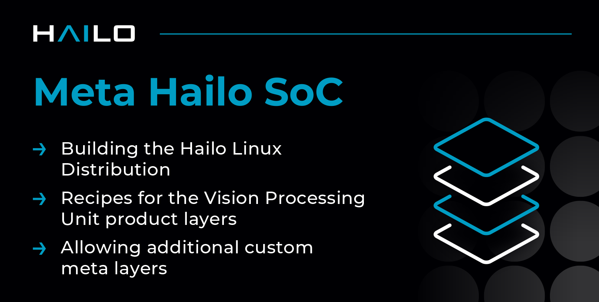

# Meta Hailo SoC #

## Introduction

This repository contains the Hailo layers for OpenEmbedded.

-   **meta-hailo-bsp**
	- This layer contains machines and Board Support Package recipes for the Vision Processor Unit architecture.
- **meta-hailo-bsp-examples**
	- This layer contains example recipes for the Vision Processor Unit.
- **meta-hailo-dsp**
	- This layer contains recipes for the Digital Processing Unit such as firmware, driver and user space applications.
- **meta-hailo-imaging**
	- This layer contains recipes for the Image Signal Processing and the Encoder such as firmware, driver and user space applications.
- **meta-hailo-linux**
 	- This layer contains recipes for the user space such as system configurations and general applications.
- **meta-hailo-media-library**
	- This layer contains recipes for the Media Library API such as LDC API, Encoder OSD API and more.

## Usage
### Prerequisites

- Install [kas](https://pypi.org/project/kas/) python package.
### Development
- kas directory contains the yml configurations used to initiate the [Bitbake](https://docs.yoctoproject.org/bitbake/) environment
- To initialize the environment and start image compilation run:
	- `kas build kas/hailo15-evb.yml`
- To start working with Bitbake CLI, activate the environment by:
	- `source poky/oe-init-build-env`

## Changelog

See hailo.ai developer zone - Vision Processor Unit changelog (registration required).

## Contact

Contact information and support is available at [**hailo.ai**](https://hailo.ai/contact-us/).

## About Hailo

Hailo offers breakthrough AI Inference Accelerators and AI Vision Processors uniquely designed to accelerate embedded deep learning applications on edge devices.

The Hailo AI Inference Accelerators allow edge devices to run deep learning applications at full scale more efficiently, effectively, and sustainably, with an architecture that takes advantage of the core properties of neural networks.

The Hailo AI Vision Processors (SoC) combine Hailo's patented and field proven AI inferencing capabilities with advanced computer vision engines, generating premium image quality and advanced video analytics.

For more information, please visit [**hailo.ai**](https://hailo.ai/).

